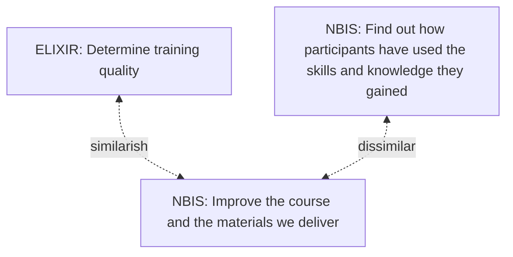

# elixir_evaluation_evaluation

An evaluation of the ELIXIR course evaluation.

# Goals

- To evaluate the ELIXIR course evaluation
- If possible, propose a better one

## Overview

- [Abstract](abstract.md)
- [Introduction](introduction.md)
- [Research questions](research_questions.md)
- [Methods](methods.md)
- Results:
    - [RQ1 Results](results_1.md)
    - [RQ2 Results](results_2.md)
    - [RQ3 Results](results_3.md)
    - [RQ4 Results](results_4.md)
- [Conclusion](conclusion.md)
- [Discussion](discussion.md)
- Appendix
    - [The current ELIXIR short-term evaluation](elixir_evaluation.md)

### How good are these questions?

The question is: how good are these questions?
To determine this, I'll first describe how these
questions are developed. After that, I will describe
the written-down goal of the questions and each of these in
detail.

### How were these questions developed?

To get a first idea of how good these evaluation questions are can be
obtained by reading how these were developed.
We can read in `[Gurwitz et al., 2020]` how this process went:
'These metrics were developed out of those already collected by ELIXIR
training providers, as well as from discussions with stakeholders,
external training providers, and literature review', with references to
two papers.
The first paper described the demograpics and short-term (i.e. directly
after the course) questions used by DataCarpentries `[Jordan et al., 2023]`,
where the second is about long-term impact `[Brazas & Ouellette, 2016]`.
At a first glance, this looks like a proper procedure.

### What are the goals of these questions?

To get a second idea of how good these evaluation questions are can be
obtained by reading the goal of the questions.

Here is the ELIXIR goal `[Gurwitz et al., 2020]`: 

> We were interested in participant satisfaction as a reflection on training
> quality in order to be able to inform best practice for ELIXIR training.

Here the intention of the NBIS short-term evaluation form is quoted:

> The intention of the STF survey is to find out how participants have used the
> skills and knowledge they gained through participating in the NBIS course.

To me, this seems like a copy-paste error from the long-term survey
by NBIS...? Section 1 seems to be more in line with a short term
evaluation:

> It is really important to us in order to continually
> improve the course and the materials we deliver

So it seems the goal of the STF is to improve the course and its materials.

### Missing questions

There are some questions that were removed from the Data Carpentries
evaluations.

### How to evaluate these questions?

The goal is this exercise is:

- To evaluate the ELIXIR course evaluation
- If possible, propose a better one

To achieve this goal, these are the steps:

- Collect evaluation questions that were thought of as 'good'
- Of these and the NBIS SFT evaluation questions,
  collect reasons why this would be a 'good' or 'bad' question
- Of the questions and reasonings, assign a rating per question

## Epilogue

We know that teachers reflecting on their work is one of the
best ways to increase his/her teaching quality.
Or: 'student ratings can only become a tool for enhancement when they
feed reflective conversations about improving the learning process and when
these conversations are informed by the scholarship of teaching and
learning `[Roxå et al., 2021]`.
The other best way for teachers to improve is to do peer observations.
Note that neither practice needs an evaluations.

If we really care about teaching quality, shouldn't we encourage
doing the things that actually work?

## Notes

I think this is a useful evaluation using learning objectives:
- https://uppmax.github.io/bianca_workshops/evaluations/20241111/

I think this is a useful evaluation for improving as a teacher:
- https://uppmax.github.io/programming_formalisms/reflections/2024_autumn/20241122_richel/

Here is an example of how useful questions can be determined:

- https://github.com/UPPMAX/R-python-julia-matlab-HPC/blob/main/reflections/20241024_richel/README.md#evaluation-results
- https://uppmax.github.io/programming_formalisms/reflections/2024_autumn/20241122_richel/

## References

- `[Ang et al., 2018]` Ang, Lawrence, Yvonne Alexandra Breyer, and Joseph Pitt.
  "Course recommendation as a construct in student evaluations:
  will students recommend your course?." Studies in Higher Education 43.6
  (2018): 944-959.
- `[Brazas & Ouellette, 2016]`
  Brazas, Michelle D., and BF Francis Ouellette.
  "Continuing education workshops in bioinformatics positively impact
 research and careers." PLoS computational biology 12.6 (2016): e1004916.
- `[Gurwitz et al., 2020]`
  Gurwitz, Kim T., et al. 
  "A framework to assess the quality and impact of bioinformatics training
  across ELIXIR." PLoS computational biology 16.7 (2020): e1007976.
  [website](https://journals.plos.org/ploscompbiol/article?id=10.1371/journal.pcbi.1007976)
- `[Jordan et al., 2023]`
  Jordan, Kari, François Michonneau, and Belinda Weaver.
  "Analysis of Software and Data Carpentry’s pre-and post-workshop surveys."
  Software Carpentry. Retrieved April 13 (2018): 2023.
- `[Roxå et al., 2021]` Roxå, Torgny, et al. 
  "Reconceptualizing student ratings of teaching to support quality discourse
  on student learning: a systems perspective." Higher Education (2021): 1-21.
- [Uttl et al., 2017]
  Uttl, Bob, Carmela A. White, and Daniela Wong Gonzalez.
  "Meta-analysis of faculty's teaching effectiveness:
  Student evaluation of teaching ratings and student learning are not related."
  Studies in Educational Evaluation 54 (2017): 22-42.
