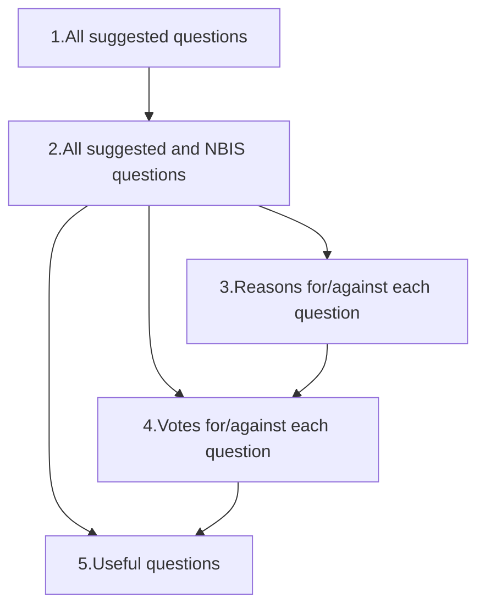

# Methods

## RQ1: What is the history of the ELIXIR evaluation questions?

A literature search is performed to find out the history
of the current ELIXIR evaluation questions,
with a focus on answering the following sub-questions:

- How were these evaluation questions developed?
- By which criteria where the best questions selected?

The results can be found at [RQ1 results](results_1.md).

## RQ2: Can the current ELIXIR evaluation questions be criticized?

A literature search is performed to assess the usefulness of the questions
in the ELIXIR SFT.

The results can be found at [RQ2 results](results_2.md).

<!-- markdownlint-disable MD013 --><!-- Headings cannot be split up over lines, hence will break 80 characters per line -->

## RQ3: Which ELIXIR evaluation questions are concluded from a fully transparent process?

<!-- markdownlint-enable MD013 -->




> Figure 1. Overview of the procedure


Phase|Goal
-----|----------------------------------------------------------------------
1    |Collect all questions that are considered 'good' by at least 1 NBIS trainer
2    |Collect all questions that are considered 'good' by NBIS and ELIXIR
3    |Collect all reasons for and against each question
4    |Rate all questions
5    |Select the questions that are considered good by the NBIS community
6    |Merge overlapping questions

The procedure is as follows:

- At an NBIS Training Liaison meeting, introduce this procedure to the people
  involved in training, as well as advertise in the relevant communication
- Collect all questions that teachers think are useful anonymously,
  creating [data_set_1.csv](data_set_1.csv)

???- question "How does that data set look like?"

    Here is an example:

    ```text
    question,reply
    What is your favorite animal?,Open question
    What is your favorite color?,Open question
    What is your favorite color?,orange;red
    ```

- Combine `Data Set 1` with the current NBIS questions. Mix these questions
  randomly,
  creating [data_set_2.csv](data_set_2.csv)

???- question "How does that data set look like?"

    Here is an example:

    ```text
    question,reply
    What is your favorite color?,orange;red
    Would you recommend the course?,Yes;No;Maybe
    What is your favorite animal?,Open question
    What is your favorite color?,Open question
    ```

- Per question, as the teachers anonymously for reasons why
  they would be for or against each question.
  The collection of reasonings per questions results in
  [data_set_3.csv](data_set_3.csv)

???- question "How does that data set look like?"

    Here is an example:

    <!-- markdownlint-disable MD013 --><!-- Plain text cannot be split up over lines, hence will break 80 characters per line -->

    ```text
    question,reply,vote,reason
    What is your favorite color?,orange;red,Con,Irrelevant to the course
    Would you recommend the course?,Yes;No;Maybe,Con,This is irrelavant for course quality
    Would you recommend the course?,Yes;No;Maybe,Pro,This is a good proxy for course quality
    What is your favorite animal?,Open question,Con,Irrelevant to the course
    What is your favorite animal?,Open question,Pro,Would be nice to know
    What is your favorite color?,Open question,Con,Irrelevant to the course
    ```

    <!-- markdownlint-enable MD013 -->

- Per question, and its pros and cons, vote anonymously if the question
  is useful enough to be included in a survey. Allow 'no', 'yes' and neutral
  [data_set_4.csv](data_set_4.csv)

???- question "How does that data set look like?"

    Here is an example:

    ```text
    question,reply,vote
    What is your favorite color?,orange;red,No
    What is your favorite color?,orange;red,No
    What is your favorite color?,orange;red,Neutral
    Would you recommend the course?,Yes;No;Maybe,No
    Would you recommend the course?,Yes;No;Maybe,Yes
    Would you recommend the course?,Yes;No;Maybe,Yes
    What is your favorite animal?,Open question,No
    What is your favorite animal?,Open question,No
    What is your favorite animal?,Open question,Yes
    What is your favorite color?,Open question,No
    What is your favorite color?,Open question,No
    What is your favorite color?,Open question,Neutral
    ```

The end product is the set of questions that had more 'yes' than 'no' votes:
these are the questions that this NBIS community thinks are useful.

???- question "How does that data set look like?"

    From the example data, this would be the result:

    ```text
    question,reply,vote
    Would you recommend the course?,Yes;No;Maybe
    ```

The results can be found at [data_set_5.csv](data_set_5.csv).

## RQ4: How different are the newly suggested questions from the current ones?

The results can be found at [RQ4 results](results_4.md).
