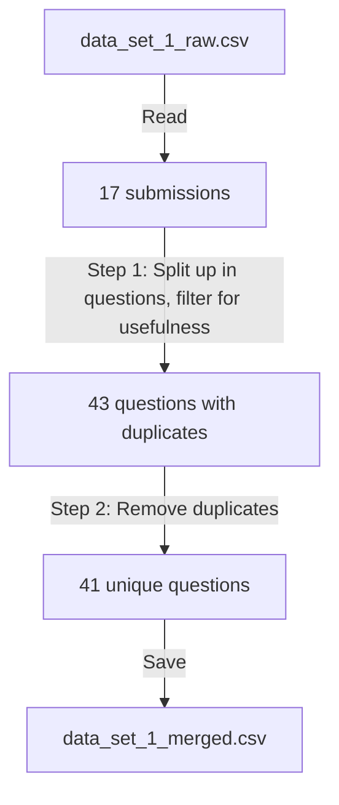

# Methods 3 Phase 1 Processing

The goals of this page is to transparantly process the data from
the 'Methods 3', phase 1.

The raw data can be found at [`data_set_1_raw.csv`](data_set_1_raw.csv),
where the resulting processed data can be found at
[`data_set_1_merged.csv`](data_set_1_merged.csv),

<!-- markdownlint-disable MD013 --><!-- Mermaid diagrams cannot be split up over lines, hence will break 80 characters per line -->

<!-- markdownlint-enable MD013 -->

Filtered out are:

- administrative questions, e.g. email addresses
- duplicates

## Step 1: filtering

Here is are the verbatum suggestions without time stamps, with an identifier added,
where the first number (always a `1` here) denotes the step.
The second number denotes the ID within that step.

<!-- markdownlint-disable MD013 --><!-- Tables cannot be split up over lines, hence will break 80 characters per line -->

ID   |Suggestion
-----|-------------------------------------------------------------------------------------------------------------------------------
1.1  |`STF form here https://docs.google.com/forms/d/e/1FAIpQLSejIRO_EHppHI9vC9QCoXFOM3DsEPU43-Pa-S-Kj5coZTuZtA/viewform?usp=sharing`
1.2  |`For each learning outcome, have the participants self-assess if they were fulfilled`
1.3  |`What is one thing you learned that you didn't expect to?`
1.4  |`What part of the training was most useful for your work/research?`
1.5  |`How did you hear about this workshop? (e.g., email, community website, colleague, social media, denbi event page)`
1.6  |`Was there anything you felt was missing from the workshop? (free text)`
1.7  |`Do you feel you can apply the knowledge gained in your daily work? (Yes, Partially, No) If partially or not, would you be interested in a more advanced workshop focused on a specific topic? (free text)`
1.8  |`The general feeling after the completion, What was difficult to understand, what would you change if you could`
1.9  |`- Was the course well organised?  yes, no or a scale -Was the course content well structured and balanced between theory and hands on?yes, no or a scale -Were the material supporting the course well designed and easy to use? yes, no or a scale -What were the strengths of this course ? free text -What aspects of this course could be improved (changes, additions) ? free text -Do you have any feedback for the trainer(s), which could be positive comments or things to improve? They can be related to the effectiveness of training delivery, oral expression, ability to answer questions, attitudes, domain expertise, ease in facilitating training, or any other.  free text -Were you able to transpose and apply the theorical and practical knowledge into your own research work/scientific question? scale and or free text`
1.10 |`How useful were the training materials (slides, datasets, exercises)? Scale from 1 (not) to 10 (very much)`
1.11 |`What improvements would you suggest for the materials? Free text`
1.12 |`I feel confident applying what I learned in my future work. Scale from 1 (not) to 10 (very much)`
1.13 |`hat would help you apply this training more effectively? Free text`
1.14 |`I suggest to add: 1. Was the theoretical content useful to carry out the exercises? 2. Were there sufficient trainers and helpers to answer your questions?`
1.15 |`The question 'Any (other) feedback?' with a textbox that can be edited freely (i.e. no max count of words)`
1.16 |`For all teachers: 'Say something positive about teacher X' and 'Say something teacher X can improve', both with text boxes that can be edited freely (i.e. no min nor max word count)`
1.17 |`For all learning outcomes:  Give you confidence levels of the following statements, using this scale:  0: I don't know even what this is about ...? 1: I have no confidence I can do this 2: I have low confidence I can do this 3: I have some confidence I can do this 4: I have good confidence I can do this 5: I absolutely can do this!  Then let people pick either no answer or one of these answers.`

<!-- markdownlint-enable MD013 -->

The goal of this step is to assign a new ID (starting with a `2`) for:

- each of the questions in the same suggestion
- each question to assess course quality
  (i.e. filter out administrative questions).
  If there is doubt if a suggested question can be used to improve
  course quality, the question is accepted, as in the next phase
  of the experiment, a less useful question will get voted out anyways

Duplicates will be removed in the next step.

### Submission 1.1

<!-- markdownlint-disable MD013 --><!-- Tables cannot be split up over lines, hence will break 80 characters per line -->

ID   |Suggestion
-----|-------------------------------------------------------------------------------------------------------------------------------
1.1  |`STF form here https://docs.google.com/forms/d/e/1FAIpQLSejIRO_EHppHI9vC9QCoXFOM3DsEPU43-Pa-S-Kj5coZTuZtA/viewform?usp=sharing`

<!-- markdownlint-enable MD013 -->

This suggestion contains
[a link to the NBIS Short Term Feedback (STF) survey](https://docs.google.com/forms/d/e/1FAIpQLSejIRO_EHppHI9vC9QCoXFOM3DsEPU43-Pa-S-Kj5coZTuZtA/viewform?usp=sharing).

Here I collect all questions from that survey and determine if these
are useful to assess course quality

<!-- markdownlint-disable MD013 --><!-- Tables cannot be split up over lines, hence will break 80 characters per line -->

ID   |Suggestion
-----|-------------------------------------------------------------------------------------------------------------------------------
1.1.1|`[single-line open answer]` Event code

<!-- markdownlint-enable MD013 -->

This is an adminstrative question and will be filtered out.

<!-- markdownlint-disable MD013 --><!-- Tables cannot be split up over lines, hence will break 80 characters per line -->

ID   |Suggestion
-----|-------------------------------------------------------------------------------------------------------------------------------
1.1.2|`[MCQ, must select 1]` What is your career stage? `-` Undergraduate student `-` Masters student `-` PhD candidate `-` Postdoctoral researcher `-` Senior scientist/Principal investigator `-` Research assistant/ Technician / Support staff `-` Research engineer/Staff scientist/Technical scientist `-` Industry scientist `-` Other: `[single-line open answer]`

<!-- markdownlint-enable MD013 -->

This multiple choice question ('MCQ') is an adminstrative question
and will be filtered out.

<!-- markdownlint-disable MD013 --><!-- Tables cannot be split up over lines, hence will break 80 characters per line -->

ID   |Suggestion
-----|-------------------------------------------------------------------------------------------------------------------------------
1.1.3|`[multiple checkbox question]` University/Organisation. Please select all relevant choices. `-` Chalmers `-` Göteborgs Universitet `-` Karolinska Institutet `-` Kungliga Tekniska Högskolan, KTH `-` Linköpings Universitet `-` Luleå Universitet `-` Lunds Universitet `-` Naturhistoriska Riksmuseet `-` Örebro Universitet `-` Stockholms Universitet `-` Sveriges lantbruksuniversitet, SLU `-` Umeå Universitet `-` Uppsala Universitet `-` SciLifeLab `-` Other: `[single-line open answer]`

<!-- markdownlint-enable MD013 -->

This is an adminstrative question and will be filtered out.

<!-- markdownlint-disable MD013 --><!-- Tables cannot be split up over lines, hence will break 80 characters per line -->

ID   |Suggestion
-----|-------------------------------------------------------------------------------------------------------------------------------
1.1.4|`[MCQ, select 1]` What is your gender? `-` Man `-` Woman `-` Prefer not to say `-` Non-binary `-` Other: `[single-line open answer]`

<!-- markdownlint-enable MD013 -->

This is an adminstrative question and will be filtered out.

<!-- markdownlint-disable MD013 --><!-- Tables cannot be split up over lines, hence will break 80 characters per line -->

ID   |Suggestion
-----|-------------------------------------------------------------------------------------------------------------------------------
1.1.5|`[MCQ, select 1]` Have you used the tools/resources covered in the course before? `-` Never - unaware of them `-` Never - used others `-` Never - aware of them, but not used them `-` Occasionally (once in a while to monthly) `-` Frequently (weekly to daily)

<!-- markdownlint-enable MD013 -->

This is a question to assess course quality, as it is part of a session
called 'Quality metrics'. It will be labelled `2.1`.

On its own, asking learners to share if they used a certain tool before is
useless in improving a course, even though it may to get an idea
of curiousity or initial knowledge.

However, together with a question to ask the learner
to if they will use the tools again may be a way to get an idea of
course quality, expressed in the **change** of (likelihood of) using tools.

<!-- markdownlint-disable MD013 --><!-- Tables cannot be split up over lines, hence will break 80 characters per line -->

ID   |Suggestion
-----|-------------------------------------------------------------------------------------------------------------------------------
1.1.6|`[MCQ, select 1]` Will you use the tools/resources covered in the course again? `-` Yes `-` No `-` Maybe

<!-- markdownlint-enable MD013 -->

This is a question to assess course quality, as it is part of a session
called 'Quality metrics'. It will be labelled `2.2`.

<!-- markdownlint-disable MD013 --><!-- Tables cannot be split up over lines, hence will break 80 characters per line -->

ID   |Suggestion
-----|-------------------------------------------------------------------------------------------------------------------------------
1.1.7|`[MCQ, select 1]` Would you recommend this course? `-` Yes `-` No `-` Maybe

<!-- markdownlint-enable MD013 -->

This is a question to assess course quality, as it is part of a session
called 'Quality metrics'. It will be labelled `2.3`.

<!-- markdownlint-disable MD013 --><!-- Tables cannot be split up over lines, hence will break 80 characters per line -->

ID   |Suggestion
-----|-------------------------------------------------------------------------------------------------------------------------------
1.1.8|`[MCQ, select 1]` What is your overall rating for the course? `-` Excellent (5) `-` Very Good (4) `-` Good (3) `-` Satisfactory (2) `-` Poor (1)

<!-- markdownlint-enable MD013 -->

This is a question to assess course quality, as it is part of a session
called 'Quality metrics'. It will be labelled `2.4`.

<!-- markdownlint-disable MD013 --><!-- Tables cannot be split up over lines, hence will break 80 characters per line -->

ID   |Suggestion
-----|-------------------------------------------------------------------------------------------------------------------------------
1.1.9|`[multi-line open answer]` What part of the training did you enjoy the most?

<!-- markdownlint-enable MD013 -->

This is a question to assess course quality. It will be labelled `2.5`.

<!-- markdownlint-disable MD013 --><!-- Tables cannot be split up over lines, hence will break 80 characters per line -->

ID    |Suggestion
------|-------------------------------------------------------------------------------------------------------------------------------
1.1.10|`[multi-line open answer]` What part of the training did you enjoy the least?

<!-- markdownlint-enable MD013 -->

This is a question to assess course quality. It will be labelled `2.6`.

<!-- markdownlint-disable MD013 --><!-- Tables cannot be split up over lines, hence will break 80 characters per line -->

ID    |Suggestion
------|-------------------------------------------------------------------------------------------------------------------------------
1.1.11|`[MCQ, must select 1]` The balance of theoretical and practical content was `-` Too theoretical `-` Too practical `-` About right

<!-- markdownlint-enable MD013 -->

This is a question to assess course quality. It will be labelled `2.7`.

<!-- markdownlint-disable MD013 --><!-- Tables cannot be split up over lines, hence will break 80 characters per line -->

ID    |Suggestion
------|-------------------------------------------------------------------------------------------------------------------------------
1.1.12|`[MCQ, must select 1]` How do you rate the pre-course information given? `-` 1 (Very unsatisfactory/Not useful) `-` 2 `-` 3 `-` 4 `-` 5 (Very good/Very useful)

<!-- markdownlint-enable MD013 -->

This is a question to assess course quality. It will be labelled `2.8`.

<!-- markdownlint-disable MD013 --><!-- Tables cannot be split up over lines, hence will break 80 characters per line -->

ID    |Suggestion
------|-------------------------------------------------------------------------------------------------------------------------------
1.1.13|`[MCQ, must select 1]` Please rate each session of the course `-` Did not attend `-` Poor (1) `-` Satisfactory (2) `-` Good (3) `-` Very Good (4) `-` Excellent (5) `-` Other: `[single-line open answer]`

<!-- markdownlint-enable MD013 -->

This is a question to assess course quality. It will be labelled `2.9`.

<!-- markdownlint-disable MD013 --><!-- Tables cannot be split up over lines, hence will break 80 characters per line -->

ID    |Suggestion
------|-------------------------------------------------------------------------------------------------------------------------------
1.1.14|`[multi-line open answer]` Comments on teaching staff. Help our teaching staff to improve by providing constructive feedback

<!-- markdownlint-enable MD013 -->

This is a question to assess course quality. It will be labelled `2.10`.

<!-- markdownlint-disable MD013 --><!-- Tables cannot be split up over lines, hence will break 80 characters per line -->

ID    |Suggestion
------|-------------------------------------------------------------------------------------------------------------------------------
1.1.15|`[MCQ, must select 1]` Was the course held at a teaching level matching your training? Please describe in "Other" if you want to give any additional information to the Course leader(s) `-` Yes `-` No `-` Other: `[single-line open answer]`

<!-- markdownlint-enable MD013 -->

This is a question to assess course quality. It will be labelled `2.11`.

<!-- markdownlint-disable MD013 --><!-- Tables cannot be split up over lines, hence will break 80 characters per line -->

ID    |Suggestion
------|-------------------------------------------------------------------------------------------------------------------------------
1.1.16|`[multi-line open answer]` Statements regarding what participants could do before the training event (customised to a specific training)

<!-- markdownlint-enable MD013 -->

This is a question to assess course quality. It will be labelled `2.12`.

On its own, asking learners to self-assess the learning outcomes is
useless in improving a course, even though it does help establish
course relevancy.

However, together with a question to ask the learner
to self-assess the learning outcomes at the end of a course,
this **is** way to get an idea of course quality, expressed in the
**change** of self-rated confidence in the learning outcomes.

<!-- markdownlint-disable MD013 --><!-- Tables cannot be split up over lines, hence will break 80 characters per line -->

ID    |Suggestion
------|-------------------------------------------------------------------------------------------------------------------------------
1.1.17|`[multi-line open answer]` Statements regarding what participants can do after the training event (customised to a specific training)

<!-- markdownlint-enable MD013 -->

This is a question to assess course quality. It will be labelled `2.13`.

<!-- markdownlint-disable MD013 --><!-- Tables cannot be split up over lines, hence will break 80 characters per line -->

ID    |Suggestion
------|-------------------------------------------------------------------------------------------------------------------------------
1.1.18|`[multi-line open answer]` What other topics would you like to see covered in the future?

<!-- markdownlint-enable MD013 -->

This is an adminstrative question and will be filtered out.

I do see how this question may indirectly assesses course quality:
if topics are suggested for future courses,
this may somehow be correlated to higher course quality of the course given.

<!-- markdownlint-disable MD013 --><!-- Tables cannot be split up over lines, hence will break 80 characters per line -->

ID    |Suggestion
------|-------------------------------------------------------------------------------------------------------------------------------
1.1.19|`[multi-line open answer]` Any other comments?

<!-- markdownlint-enable MD013 -->

This is a question to assess course quality. It will be labelled `2.15`.

<!-- markdownlint-disable MD013 --><!-- Tables cannot be split up over lines, hence will break 80 characters per line -->

ID    |Suggestion
------|-------------------------------------------------------------------------------------------------------------------------------
1.1.20|`[MCQ, must select 1]` What would be the prefered length of the course? `-` 1 day `-` 2 days `-` 3 days `-` 4 days `-` 5 days

<!-- markdownlint-enable MD013 -->

This not to be a question to assess course quality:
this question asks the learners for their preferences,
which may be useful to help change the duration of a course.
It will be filtered out.

<!-- markdownlint-disable MD013 --><!-- Tables cannot be split up over lines, hence will break 80 characters per line -->

ID    |Suggestion
------|-------------------------------------------------------------------------------------------------------------------------------
1.1.21|`[MCQ, must select 1]` What is the best format for this course? `-` Onsite `-` Online `-` Online but spaced out `-` Other: `[single-line open answer]`

<!-- markdownlint-enable MD013 -->

This is not a question to assess course quality:
this question asks the learners for their preferences,
which may be useful to help change the format of a course.
It will be filtered out.

<!-- markdownlint-disable MD013 --><!-- Tables cannot be split up over lines, hence will break 80 characters per line -->

ID    |Suggestion
------|-------------------------------------------------------------------------------------------------------------------------------
1.1.22|`[MCQ, must select 1]` How did you like the localities of the course (rooms and surrondings)? `-` 1 (Not at all) `-` 2 `-` 3 `-` 4 `-` 5 (Very much)

<!-- markdownlint-enable MD013 -->

This is a question to assess course quality, as it helps evaluate
the quallity of the learning environment It will be labelled `2.41`.

<!-- markdownlint-disable MD013 --><!-- Tables cannot be split up over lines, hence will break 80 characters per line -->

ID    |Suggestion
------|-------------------------------------------------------------------------------------------------------------------------------
1.1.23|`[MCQ, must select 1]` How did you like the lunch(es) and "fika(s)"? `-` 1 (Not at all) `-` 2 `-` 3 `-` 4 `-` 5 (Very much)

<!-- markdownlint-enable MD013 -->

I consider this not to be a question to assess course quality.
It will be filtered out.

<!-- markdownlint-disable MD013 --><!-- Tables cannot be split up over lines, hence will break 80 characters per line -->

ID    |Suggestion
------|-------------------------------------------------------------------------------------------------------------------------------
1.1.24|`[multi-line open answer]` Any other comments?

<!-- markdownlint-enable MD013 -->

I consider this not to be a question to assess course quality,
as it is part of a 'Training logistics' session.
Taking a look at the other questions in that session, this
question is about any other comments on the training logistics.
That means that this is not a question about course quality.
It will be filtered out.

### Submission 1.2

<!-- markdownlint-disable MD013 --><!-- Tables cannot be split up over lines, hence will break 80 characters per line -->

ID  |Suggestion
----|-------------------------------------------------------------------------------------------------------------------------------
1.2 |For each learning outcome, have the participants self-assess if they were fulfilled

<!-- markdownlint-enable MD013 -->

This is a question to assess course quality. It is unclear in what form the
question needs to be answered: should it be a yes/no checkbox, or a scale?

It will be labelled `2.16`.

### Submission 1.3

<!-- markdownlint-disable MD013 --><!-- Tables cannot be split up over lines, hence will break 80 characters per line -->

ID  |Suggestion
----|-------------------------------------------------------------------------------------------------------------------------------
1.3 |What is one thing you learned that you didn't expect to?

<!-- markdownlint-enable MD013 -->

This is a question to assess course quality. It will be labelled `2.17`.

### Submission 1.4

<!-- markdownlint-disable MD013 --><!-- Tables cannot be split up over lines, hence will break 80 characters per line -->

ID  |Suggestion
----|-------------------------------------------------------------------------------------------------------------------------------
1.4 |What part of the training was most useful for your work/research?`

<!-- markdownlint-enable MD013 -->

This is a question to assess course quality. It will be labelled `2.18`.

### Submission 1.5

<!-- markdownlint-disable MD013 --><!-- Tables cannot be split up over lines, hence will break 80 characters per line -->

ID  |Suggestion
----|-------------------------------------------------------------------------------------------------------------------------------
1.5 |How did you hear about this workshop? (e.g., email, community website, colleague, social media, denbi event page)

<!-- markdownlint-enable MD013 -->

This is an adminstrative question and will be filtered out.

I do see how this question may indirectly assesses course quality:
if colleagues recommend the course, this may somehow be correlated
to higher course quality.

### Submission 1.6

<!-- markdownlint-disable MD013 --><!-- Tables cannot be split up over lines, hence will break 80 characters per line -->

ID  |Suggestion
----|-------------------------------------------------------------------------------------------------------------------------------
1.6 |Was there anything you felt was missing from the workshop? (free text)

<!-- markdownlint-enable MD013 -->

This is a question to assess course quality. It will be labelled `2.19`.

### Submission 1.7

<!-- markdownlint-disable MD013 --><!-- Tables cannot be split up over lines, hence will break 80 characters per line -->

ID   |Suggestion
-----|-------------------------------------------------------------------------------------------------------------------------------
1.7.1|Do you feel you can apply the knowledge gained in your daily work? (Yes, Partially, No)

<!-- markdownlint-enable MD013 -->

This is a question to assess course quality. It will be labelled `2.20`.

<!-- markdownlint-disable MD013 --><!-- Tables cannot be split up over lines, hence will break 80 characters per line -->

ID   |Suggestion
-----|-------------------------------------------------------------------------------------------------------------------------------
1.7.2|If partially or not, would you be interested in a more advanced workshop focused on a specific topic? (free text)

<!-- markdownlint-enable MD013 -->

This is an adminstrative question and will be filtered out.

I do see how this question may indirectly assesses course quality:
if there is a desire to do a follow-up workshop,
this may somehow be correlated
to higher course quality.

### Submission 1.8

<!-- markdownlint-disable MD013 --><!-- Tables cannot be split up over lines, hence will break 80 characters per line -->

ID   |Suggestion
-----|-------------------------------------------------------------------------------------------------------------------------------
1.8.1|The general feeling after the completion

<!-- markdownlint-enable MD013 -->

This is a question to assess course quality. It will be labelled `2.21`.

<!-- markdownlint-disable MD013 --><!-- Tables cannot be split up over lines, hence will break 80 characters per line -->

ID   |Suggestion
-----|-------------------------------------------------------------------------------------------------------------------------------
1.8.2|What was difficult to understand

<!-- markdownlint-enable MD013 -->

This is a question to assess course quality. It will be labelled `2.22`.

<!-- markdownlint-disable MD013 --><!-- Tables cannot be split up over lines, hence will break 80 characters per line -->

ID   |Suggestion
-----|-------------------------------------------------------------------------------------------------------------------------------
1.8.3|what would you change if you could

<!-- markdownlint-enable MD013 -->

This is a question to assess course quality. It will be labelled `2.23`.

### Submission 1.9

<!-- markdownlint-disable MD013 --><!-- Tables cannot be split up over lines, hence will break 80 characters per line -->

ID   |Suggestion
-----|-------------------------------------------------------------------------------------------------------------------------------
1.9.1|Was the course well organised?  yes, no or a scale

<!-- markdownlint-enable MD013 -->

This is a question to assess course quality. It will be labelled `2.24`.

<!-- markdownlint-disable MD013 --><!-- Tables cannot be split up over lines, hence will break 80 characters per line -->

ID   |Suggestion
-----|-------------------------------------------------------------------------------------------------------------------------------
1.9.2|Was the course content well structured and balanced between theory and hands on? yes, no or a scale

<!-- markdownlint-enable MD013 -->

This is a question to assess course quality. It will be labelled `2.25`.

<!-- markdownlint-disable MD013 --><!-- Tables cannot be split up over lines, hence will break 80 characters per line -->

ID   |Suggestion
-----|-------------------------------------------------------------------------------------------------------------------------------
1.9.3|Were the material supporting the course well designed and easy to use? yes, no or a scale

<!-- markdownlint-enable MD013 -->

This is a question to assess course quality. It will be labelled `2.26`.

<!-- markdownlint-disable MD013 --><!-- Tables cannot be split up over lines, hence will break 80 characters per line -->

ID   |Suggestion
-----|-------------------------------------------------------------------------------------------------------------------------------
1.9.4|What were the strengths of this course ? free text

<!-- markdownlint-enable MD013 -->

This is a question to assess course quality. It will be labelled `2.27`.

<!-- markdownlint-disable MD013 --><!-- Tables cannot be split up over lines, hence will break 80 characters per line -->

ID   |Suggestion
-----|-------------------------------------------------------------------------------------------------------------------------------
1.9.5|What aspects of this course could be improved (changes, additions) ? free text

<!-- markdownlint-enable MD013 -->

This is a question to assess course quality. It will be labelled `2.28`.

<!-- markdownlint-disable MD013 --><!-- Tables cannot be split up over lines, hence will break 80 characters per line -->

ID   |Suggestion
-----|-------------------------------------------------------------------------------------------------------------------------------
1.9.6|Do you have any feedback for the trainer(s), which could be positive comments or things to improve? They can be related to the effectiveness of training delivery, oral expression, ability to answer questions, attitudes, domain expertise, ease in facilitating training, or any other.  free text

<!-- markdownlint-enable MD013 -->

This is a question to assess course quality. It will be labelled `2.29`.

<!-- markdownlint-disable MD013 --><!-- Tables cannot be split up over lines, hence will break 80 characters per line -->

ID   |Suggestion
-----|-------------------------------------------------------------------------------------------------------------------------------
1.9.7|Were you able to transpose and apply the theorical and practical knowledge into your own research work/scientific question? scale and or free text`

<!-- markdownlint-enable MD013 -->

This is a question to assess course quality. It will be labelled `2.30`.

### Submission 1.10

<!-- markdownlint-disable MD013 --><!-- Tables cannot be split up over lines, hence will break 80 characters per line -->

ID   |Suggestion
-----|-------------------------------------------------------------------------------------------------------------------------------
1.10 |How useful were the training materials (slides, datasets, exercises)? Scale from 1 (not) to 10 (very much)

<!-- markdownlint-enable MD013 -->

This is a question to assess course quality. It will be labelled `2.31`.

### Submission 1.11

<!-- markdownlint-disable MD013 --><!-- Tables cannot be split up over lines, hence will break 80 characters per line -->

ID  |Suggestion
----|-------------------------------------------------------------------------------------------------------------------------------
1.11|What improvements would you suggest for the materials? Free text

<!-- markdownlint-enable MD013 -->

This is a question to assess course quality. It will be labelled `2.32`.

### Submission 1.12

<!-- markdownlint-disable MD013 --><!-- Tables cannot be split up over lines, hence will break 80 characters per line -->

ID  |Suggestion
----|-------------------------------------------------------------------------------------------------------------------------------
1.12|I feel confident applying what I learned in my future work. Scale from 1 (not) to 10 (very much)

<!-- markdownlint-enable MD013 -->

This is a question to assess course quality. It will be labelled `2.33`.

### Submission 1.13

<!-- markdownlint-disable MD013 --><!-- Tables cannot be split up over lines, hence will break 80 characters per line -->

ID  |Suggestion
----|-------------------------------------------------------------------------------------------------------------------------------
1.13|What would help you apply this training more effectively? Free text

<!-- markdownlint-enable MD013 -->

This is a question to assess course quality. It will be labelled `2.34`.

### Submission 1.14

<!-- markdownlint-disable MD013 --><!-- Tables cannot be split up over lines, hence will break 80 characters per line -->

ID    |Suggestion
------|-------------------------------------------------------------------------------------------------------------------------------
1.14.1|Was the theoretical content useful to carry out the exercises?

<!-- markdownlint-enable MD013 -->

This is a question to assess course quality. It will be labelled `2.35`.

<!-- markdownlint-disable MD013 --><!-- Tables cannot be split up over lines, hence will break 80 characters per line -->

ID    |Suggestion
------|-------------------------------------------------------------------------------------------------------------------------------
1.14.2|Were there sufficient trainers and helpers to answer your questions?

<!-- markdownlint-enable MD013 -->

This is an question about the course logistics and will be filtered out.

### Submission 1.15

<!-- markdownlint-disable MD013 --><!-- Tables cannot be split up over lines, hence will break 80 characters per line -->

ID  |Suggestion
----|-------------------------------------------------------------------------------------------------------------------------------
1.15|The question 'Any (other) feedback?' with a textbox that can be edited freely (i.e. no max count of words)

<!-- markdownlint-enable MD013 -->

This is a question to assess course quality. It will be labelled `2.37`.

### Submission 1.16

<!-- markdownlint-disable MD013 --><!-- Tables cannot be split up over lines, hence will break 80 characters per line -->

ID    |Suggestion
------|-------------------------------------------------------------------------------------------------------------------------------
1.16.1|For all teachers: 'Say something positive about teacher X' with text boxes that can be edited freely (i.e. no min nor max word count)

<!-- markdownlint-enable MD013 -->

This is a question to assess course quality. It will be labelled `2.38`.

<!-- markdownlint-disable MD013 --><!-- Tables cannot be split up over lines, hence will break 80 characters per line -->

ID    |Suggestion
------|-------------------------------------------------------------------------------------------------------------------------------
1.16.2|For all teachers: 'Say something teacher X can improve' with text boxes that can be edited freely (i.e. no min nor max word count)

<!-- markdownlint-enable MD013 -->

This is a question to assess course quality. It will be labelled `2.39`.

### Submission 1.17

<!-- markdownlint-disable MD013 --><!-- Tables cannot be split up over lines, hence will break 80 characters per line -->

ID    |Suggestion
------|-------------------------------------------------------------------------------------------------------------------------------
1.17  |`[Multiple choice, no choice is allowed]` For all learning outcomes:  Give you confidence levels of the following statements, using this scale: `-` 0: I don't know even what this is about ...? `-` 1: I have no confidence I can do this `-` 2: I have low confidence I can do this `-` 3: I have some confidence I can do this `-` 4: I have good confidence I can do this `-` 5: I absolutely can do this!

<!-- markdownlint-enable MD013 -->

This is a question to assess course quality. It will be labelled `2.40`.

## Step 2: remove duplicates

Here is are the questions from the previous step, with the identifier added,
where the first number (always a `2` here) denotes the step.
The second number denotes the ID within that step.

The raw questions have been assigned a question format.

<!-- markdownlint-disable MD013 --><!-- Tables cannot be split up over lines, hence will break 80 characters per line -->

ID   |Question format      |Question
-----|---------------------|--------------------------------------------
2.1  |MCQ, must select 1   |Have you used the tools/resources covered in the course before? `-` Never - unaware of them `-` Never - used others `-` Never - aware of them, but not used them `-` Occasionally (once in a while to monthly) `-` Frequently (weekly to daily)
2.2  |MCQ, must select 1   |Will you use the tools/resources covered in the course again? `-` Yes `-` No `-` Maybe
2.3  |MCQ, must select 1   |Would you recommend this course? `-` Yes `-` No `-` Maybe
2.4  |MCQ, must select 1   |What is your overall rating for the course? `-` Excellent (5) `-` Very Good (4) `-` Good (3) `-` Satisfactory (2) `-` Poor (1)
2.5  |Free text            |What part of the training did you enjoy the most?
2.6  |Free text            |What part of the training did you enjoy the least?
2.7  |MCQ, must select 1   |The balance of theoretical and practical content was `-` Too theoretical `-` Too practical `-` About right
2.8  |MCQ, must select 1   |How do you rate the pre-course information given? `-` 1 (Very unsatisfactory/Not useful) `-` 2 `-` 3 `-` 4 `-` 5 (Very good/Very useful)
2.9  |MCQ, must select 1   |Per session: please rate each session of the course `-` Did not attend `-` Poor (1) `-` Satisfactory (2) `-` Good (3) `-` Very Good (4) `-` Excellent (5) `-` Other: `[single-line open answer]`
2.10 |Free text            |Comments on teaching staff. Help our teaching staff to improve by providing constructive feedback
2.11 |MCQ, must select 1   |Was the course held at a teaching level matching your training? Please describe in "Other" if you want to give any additional information to the Course leader(s) `-` Yes `-` No `-` Other: `[single-line open answer]`
2.12 |Free text            |statements regarding what participants could do before the training event
2.13 |Free text            |statements regarding what participants can do after the training event
2.14 |.                    |Removed
2.15 |Free text            |Any other comments?
2.16 |Unknown              |For each learning outcome, have the participants self-assess if they were fulfilled
2.17 |Open question        |What is one thing you learned that you didn't expect to?
2.18 |Open question        |What part of the training was most useful for your work/research?
2.19 |Free text            |Was there anything you felt was missing from the workshop?
2.20 |MCQ                  |Do you feel you can apply the knowledge gained in your daily work? `-` Yes `-` Partially `-` No
2.21 |Open question        |The general feeling after the completion
2.22 |Open question        |What was difficult to understand
2.23 |Open question        |What would you change if you could
2.24a|Yes/no               |Was the course well organised?
2.24b|Scale                |Was the course well organised?
2.25a|Yes/no               |Was the course content well structured and balanced between theory and hands on?
2.25b|Scale                |Was the course content well structured and balanced between theory and hands on?
2.26a|Yes/no               |Were the material supporting the course well designed and easy to use?
2.26b|Scale                |Were the material supporting the course well designed and easy to use?
2.27 |Free text            |What were the strengths of this course ?
2.28 |Free text            |What aspects of this course could be improved (changes, additions) ?
2.29 |Free text            |Do you have any feedback for the trainer(s), which could be positive comments or things to improve? They can be related to the effectiveness of training delivery, oral expression, ability to answer questions, attitudes, domain expertise, ease in facilitating training, or any other
2.30a|Scale                |Were you able to transpose and apply the theorical and practical knowledge into your own research work/scientific question?
2.30b|Free text            |Were you able to transpose and apply the theorical and practical knowledge into your own research work/scientific question?
2.31 |MCQ, must select 1   |How useful were the training materials (slides, datasets, exercises)? Scale from 1 (not) to 10 (very much)
2.32 |Free text            |What improvements would you suggest for the materials?
2.33 |MCQ, must select 1   |I feel confident applying what I learned in my future work. Scale from 1 (not) to 10 (very much)
2.34 |Free text            |What would help you apply this training more effectively?
2.35 |Unspecified          |Was the theoretical content useful to carry out the exercises?
2.36 |.                    |Removed
2.37 |Free text            |Any (other) feedback?
2.38 |Free text            |For all teachers: 'Say something positive about teacher X'
2.39 |Free text            |For all teachers: 'Say something teacher X can improve'
2.40 |MCQ, can select 0    |For all learning outcomes:  Give you confidence levels of the following statements, using this scale: `-` 0: I don't know even what this is about ...? `-` 1: I have no confidence I can do this `-` 2: I have low confidence I can do this `-` 3: I have some confidence I can do this `-` 4: I have good confidence I can do this `-` 5: I absolutely can do this!
2.41 |MCQ, must select 1   |How did you like the localities of the course (rooms and surrondings)? `-` 1 (Not at all) `-` 2 `-` 3 `-` 4 `-` 5 (Very much)

<!-- markdownlint-enable MD013 -->

> MCQ: Multiple choice question

In this table, we remove the duplicates:

<!-- markdownlint-disable MD013 --><!-- Tables cannot be split up over lines, hence will break 80 characters per line -->

ID   |ID       |Question summary        |Question format      |Question
-----|---------|------------------------|---------------------|----------------------------------------------------------------------------------------------------------------------------------------------------------------------------------------------------------------------------
2.1  |3.1      |Use resources before    |MCQ, must select 1   |Have you used the tools/resources covered in the course before? `-` Never - unaware of them `-` Never - used others `-` Never - aware of them, but not used them `-` Occasionally (once in a while to monthly) `-` Frequently (weekly to daily)
2.2  |3.2      |Use resources after     |MCQ, must select 1   |Will you use the tools/resources covered in the course again? `-` Yes `-` No `-` Maybe
2.3  |3.3      |Course recommend        |MCQ, must select 1   |Would you recommend this course? `-` Yes `-` No `-` Maybe
2.4  |3.4      |Course rating           |MCQ, must select 1   |What is your overall rating for the course? `-` Excellent (5) `-` Very Good (4) `-` Good (3) `-` Satisfactory (2) `-` Poor (1)
2.5  |3.5      |Enjoy most              |Free text            |What part of the training did you enjoy the most?
2.6  |3.6      |Enjoy least             |Free text            |What part of the training did you enjoy the least?
2.7  |3.7      |Balance theory/practice |MCQ, must select 1   |The balance of theoretical and practical content was `-` Too theoretical `-` Too practical `-` About right
2.8  |3.8      |Rate pre-course info    |MCQ, must select 1   |How do you rate the pre-course information given? `-` 1 (Very unsatisfactory/Not useful) `-` 2 `-` 3 `-` 4 `-` 5 (Very good/Very useful)
2.9  |3.9      |Rate sessions           |MCQ, must select 1   |Per session: please rate each session of the course `-` Did not attend `-` Poor (1) `-` Satisfactory (2) `-` Good (3) `-` Very Good (4) `-` Excellent (5) `-` Other: `[single-line open answer]`
2.10 |3.10     |Comment teaching staff  |Free text            |Comments on teaching staff. Help our teaching staff to improve by providing constructive feedback
2.11 |3.11     |Content matching level  |MCQ, must select 1   |Was the course held at a teaching level matching your training? Please describe in "Other" if you want to give any additional information to the Course leader(s) `-` Yes `-` No `-` Other: `[single-line open answer]`
2.12 |3.12     |Self assess LOs before  |Free text            |statements regarding what participants could do before the training event
2.13 |3.14     |Self assess LOs after   |Free text            |statements regarding what participants can do after the training event
2.15 |3.15     |Comments                |Free text            |Any other comments?
2.16 |**3.14** |Self-assess LOs after   |Unknown              |For each learning outcome, have the participants self-assess if they were fulfilled
2.17 |3.17     |Unexpected learning     |Open question        |What is one thing you learned that you didn't expect to?
2.18 |3.18     |Most useful part        |Open question        |What part of the training was most useful for your work/research?
2.19 |3.19     |Feel missing            |Free text            |Was there anything you felt was missing from the workshop?
2.20 |3.20a    |Feel can apply          |MCQ                  |Do you feel you can apply the knowledge gained in your daily work? `-` Yes `-` Partially `-` No
2.21 |3.21     |Feeling afterwards      |Open question        |The general feeling after the completion
2.22 |3.22     |Hard to understand      |Open question        |What was difficult to understand
2.23 |3.23     |Any change              |Open question        |What would you change if you could
2.24a|3.24a    |Course organisation     |Yes/no               |Was the course well organised?
2.24b|3.24b    |Course organisation     |Scale                |Was the course well organised?
2.25a|3.25a    |Course content structure|Yes/no               |Was the course content well structured and balanced between theory and hands on?
2.25b|3.25b    |Course content structure|Scale                |Was the course content well structured and balanced between theory and hands on?
2.26a|3.26a    |Course material design  |Yes/no               |Were the material supporting the course well designed and easy to use?
2.26b|3.26a    |Course material design  |Scale                |Were the material supporting the course well designed and easy to use?
2.27 |3.27     |Course strength         |Free text            |What were the strengths of this course ?
2.28 |3.28     |Improve course          |Free text            |What aspects of this course could be improved (changes, additions) ?
2.29 |3.29     |Feedback trainer        |Free text            |Do you have any feedback for the trainer(s), which could be positive comments or things to improve? They can be related to the effectiveness of training delivery, oral expression, ability to answer questions, attitudes, domain expertise, ease in facilitating training, or any other
2.30a|3.30a    |Able to apply           |Scale                |Were you able to transpose and apply the theorical and practical knowledge into your own research work/scientific question?
2.30b|3.30b    |Able to apply           |Free text            |Were you able to transpose and apply the theorical and practical knowledge into your own research work/scientific question?
2.31 |3.31     |Materials usefulness    |MCQ, must select 1   |How useful were the training materials (slides, datasets, exercises)? Scale from 1 (not) to 10 (very much)
2.32 |3.32     |Improvement materials   |Free text            |What improvements would you suggest for the materials?
2.33 |3.33     |Confidence course       |MCQ, must select 1   |I feel confident applying what I learned in my future work. Scale from 1 (not) to 10 (very much)
2.34 |3.34     |Suggest help to apply   |Free text            |What would help you apply this training more effectively?
2.35 |3.35     |Theory usefulness       |Unspecified          |Was the theoretical content useful to carry out the exercises?
2.36 |.        |.                       |.                    |Removed
2.37 |3.37     |Any feedback            |Free text            |Any (other) feedback?
2.38 |3.38     |Positive teacher        |Free text            |For all teachers: 'Say something positive about teacher X'
2.39 |3.39     |Improve teacher         |Free text            |For all teachers: 'Say something teacher X can improve'
2.40 |**3.14** |Self assess LOs after   |MCQ, can select 0    |For all learning outcomes:  Give you confidence levels of the following statements, using this scale: `-` 0: I don't know even what this is about ...? `-` 1: I have no confidence I can do this `-` 2: I have low confidence I can do this `-` 3: I have some confidence I can do this `-` 4: I have good confidence I can do this `-` 5: I absolutely can do this!
2.41 |3.40     |Like locality           |MCQ, must select 1   |How did you like the localities of the course (rooms and surrondings)? `-` 1 (Not at all) `-` 2 `-` 3 `-` 4 `-` 5 (Very much)

<!-- markdownlint-enable MD013 -->
