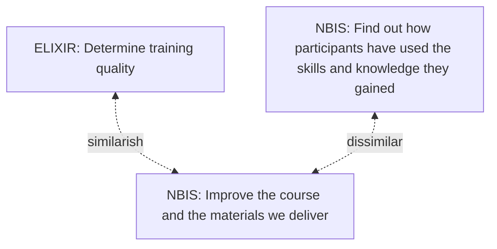
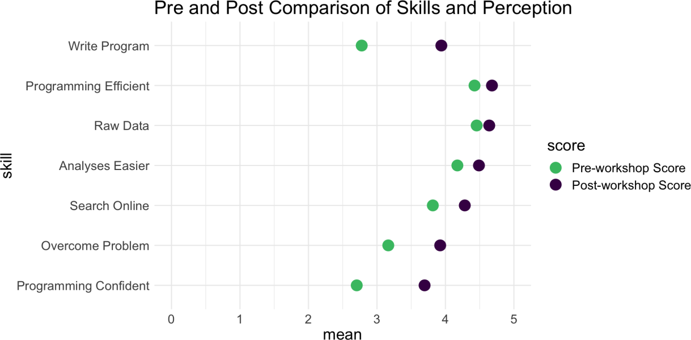
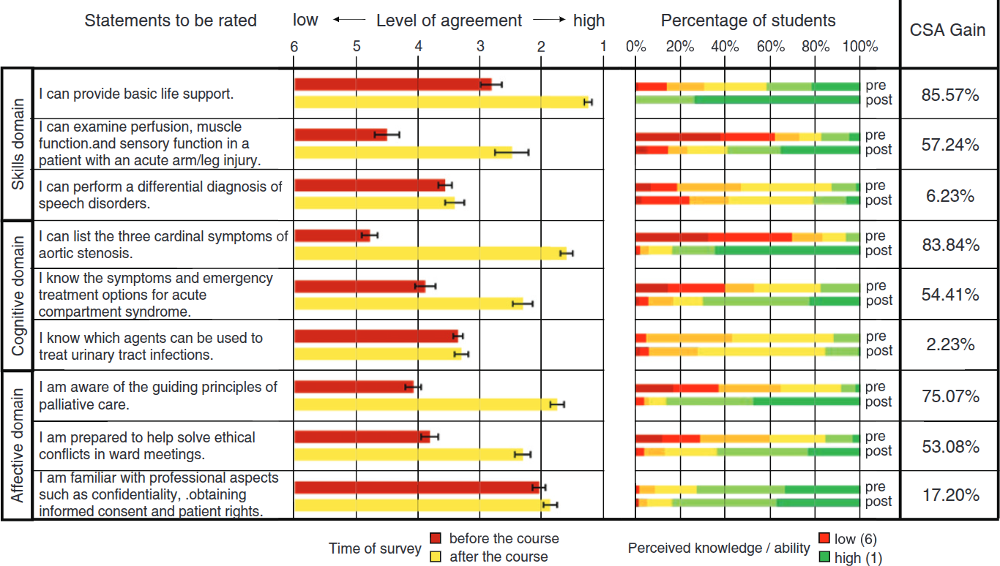

# Results of RQ1: What is the history of the ELIXIR evaluation questions?

## What is the ancestry of the NBIS questions?

The paper where these questions were described first
in `[Gurwitz et al., 2020]` . We can read that these questions
are based on `[Jordan et al., 2018]` and `[Brazas & Ouellette, 2016]`.
These last two papers do not reference any academic papers on where
their questions originated from.

## What are the goals of these questions?

<!-- markdownlint-disable MD013 --><!-- Mermaid diagrams cannot be split up over lines, hence will break 80 characters per line -->

<!-- markdownlint-enable MD013 -->

> Figure 2. Overview of the goals of the evaluation questions

To get a second idea of how good these evaluation questions are can be
obtained by reading the goal of the questions.

Here is the ELIXIR goal `[Gurwitz et al., 2020]`:

> We were interested in participant satisfaction as a reflection on training
> quality in order to be able to inform best practice for ELIXIR training.

Here the intention of the NBIS short-term evaluation form is quoted:

> The intention of the STF survey is to find out how participants have used the
> skills and knowledge they gained through participating in the NBIS course.

To me, this seems like a copy-paste error from the long-term survey
by NBIS...? Section 1 seems to be more in line with a short term
evaluation:

> It is really important to us in order to continually
> improve the course and the materials we deliver

So it seems the goal of the STF is to improve the course and its materials.

## Development of the questions

ELIXIR developed these evaluation questions to,
as quoted from `[Gurwitz et al., 2020]`:

- describe the audience demographic being reached
  by ELIXIR training events'
- assess the quality of ELIXIR training events directly
  after they have taken place'

The resulting metrics can be found at
[https://training-metrics-dev.elixir-europe.org/all-reports](https://training-metrics-dev.elixir-europe.org/all-reports).

This is what is written about how the ELIXIR short-term
evaluation questions came to be (quote from `[Gurwitz et al., 2020]`):

> We were interested in participant satisfaction as a reflection
> on training quality in order to be able to inform best practice for ELIXIR
> training.
> We acknowledge that training quality is more complex than solely participant
> satisfaction and that the community would benefit from future work
> to obtain a fuller picture on training quality.

This paragraph gives a glimmer of the
idea that the evaluation questions can be improved, referring
to future work, such as -among others- this paper.

Again from `[Gurwitz et al., 2020]` we read:

> These metrics were developed out of those already collected by ELIXIR
> training providers, as well as from discussions with stakeholders,
> external training providers, and literature review
> `[Brazas & Ouellette, 2016][Jordan et al., 2018]`

(note that using the term 'literature review' for 2 papers may be considered
a misnomer, informal sources, such as my
[first](https://www.clrn.org/how-many-sources-do-you-need-in-a-literature-review/)
and [second](https://www.clrn.org/how-many-sources-in-a-literature-review/)
on 'how many sources does a literature review need?' om Google
recommend at least 20 and 5 sources (for a 'brief review') respectively).

Nowhere has it been described how the evaluation questions
came to be and with which reasoning the best were selected.

Neither does the referred literature:

- `[Brazas & Ouellette, 2016]` shows the results of surveys from
  bioinformatics workshops. The survey questions where
  taken from other sources (i.e., the Society for Experimental Biology
  and the Global Organisation for Bioinformatics Learning, Education and
  Training), without any reference to the literature.
  It is not described how the evaluation questions
  came to be and with which reasoning the best were selected
- `[Jordan et al., 2018]` shows the results of surveys from
  Data Carpentry workshops.
  Also here, it is not described how the evaluation questions
  came to be and with which reasoning the best were selected:
  this paper has zero references to the literature

Taking a closer look at the evaluation questions of `[Jordan et al., 2018]`,
we see that some questions of its questions were not used.
The reasoning behind this is absent in `[Gurwitz et al., 2020]`.

One such removed evaluation question is to let learners self-assess
their confidence in learning outcomes.

???- question "How does such a question look like?"

    Here we can see the results of learners self-assessing
    their competences before and after the teaching session,
    figure from `[Jordan et al., 2018]`:

    

    Here we can see a similar results for an earlier
    paper `[Raupach et al., 2011]`:

    

We know that this self-assessment does not relate to actual
skill `[Liaw et al., 2012]` (with more studies showing this in that paper).
However, there is some evidence that self-assessment 
does correlate to teacher effectiveness `[Raupach et al., 2011]`,
although other studies argue that more measurements are needed to
properly assess teacher effectiveness `[Darling‐Hammond et al., 2010]`.

## References

- `[Ang et al., 2018]` Ang, Lawrence, Yvonne Alexandra Breyer, and Joseph Pitt.
  "Course recommendation as a construct in student evaluations:
  will students recommend your course?." Studies in Higher Education 43.6
  (2018): 944-959.
- `[Brazas & Ouellette, 2016]`
  Brazas, Michelle D., and BF Francis Ouellette.
  "Continuing education workshops in bioinformatics positively impact
 research and careers." PLoS computational biology 12.6 (2016): e1004916.
- `[Darling‐Hammond et al., 2010]`
  Darling‐Hammond, Linda, Xiaoxia Newton, and Ruth Chung Wei.
  "Evaluating teacher education outcomes: A study of the Stanford Teacher
  Education Programme." Journal of education for teaching 36.4 (2010): 369-388.
- `[Gurwitz et al., 2020]`
  Gurwitz, Kim T., et al.
  "A framework to assess the quality and impact of bioinformatics training
  across ELIXIR." PLoS computational biology 16.7 (2020): e1007976.
  [website](https://journals.plos.org/ploscompbiol/article?id=10.1371/journal.pcbi.1007976)
- `[Jordan et al., 2018]`
  Jordan, Kari, François Michonneau, and Belinda Weaver.
  "Analysis of Software and Data Carpentry’s pre-and post-workshop surveys."
  Software Carpentry. Retrieved April 13 (2018): 2023.
  [PDF](papers/jordan_et_al_2018.pdf)
- `[Liaw et al., 2012]`
  Liaw, Sok Ying, et al. "Assessment for simulation learning outcomes: a
  comparison of knowledge and self-reported confidence with observed clinical
  performance." Nurse education today 32.6 (2012): e35-e39.
- `[Roxå et al., 2021]` Roxå, Torgny, et al.
  "Reconceptualizing student ratings of teaching to support quality discourse
  on student learning: a systems perspective." Higher Education (2021): 1-21.
- `[Raupach et al., 2011]`
  Raupach, Tobias, et al. "Towards outcome-based programme evaluation:
  using student comparative self-assessments to determine teaching
  effectiveness." Medical teacher 33.8 (2011): e446-e453.
