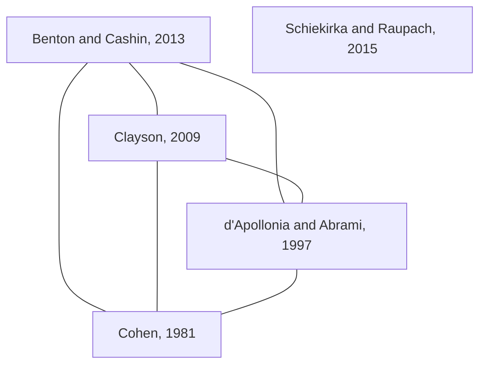

# 4.2. Results of RQ2

???- question "What are the ELIXIR evaluation questions?"

    Read [the ELIXIR evaluation questions](elixir_evaluation.md).

    This paper deals only with the mandatory questions 5 to and including 9.

With the goal of the SFT ('to improve the course and its materials')
in mind, here we go through the mandatory
questions that resulted from the process
described in the results of Research Question 1.
The relevant questions are found in `Section 3 - Quality Metrics`
of the NBIS short-term evaluation.
Here, we go through each of these questions in detail.

## 4.2.1. Question 5

```text
5. Have you used the tools/resource(s) covered in the course before?

- Never - Unaware of them
- Never - Used other service
- Occasionally
- Frequently
```

Question 5 is an interesting way to evaluate the quality of a course,
because it is about something learners have done
**before** the course took place.
Searching the literature
for 'using previous experience in course evaluations' (and sentences
alike) resulted in zero hits.

???- question "What are the metrics for this question?"

    These are the metrics collected at 2025-01-24 7:04 Stockholm
    time ([https://training-metrics-dev.elixir-europe.org/feedback-report](https://training-metrics-dev.elixir-europe.org/feedback-report)):

    Reponse                   |n   |Frequency (%)
    --------------------------|----|--------------
    Never - Unaware of them   |4350|23.5
    Never - aware of them     |3838|20.8
    Never - Used other service|1803|9.7
    Occasionally              |6974|37.7
    Frequently                |1528|8.3

## 4.2.2. Question 6

```text
6. Will you use the tools/resource(s) covered in the course again?

- Yes
- No
- Maybe
```

Question 6 is another interesting way to evaluate the quality of a course,
because it is about the usefulness of the topic being taught,
combined with predicting the future.
Searching the literature
for 'using self-predicted future use of content in course evaluations'
(and sentences alike) resulted in zero hits.

???- question "What are the metrics for this question?"

    These are the metrics collected at 2025-01-24 7:16 Stockholm
    time ([https://training-metrics-dev.elixir-europe.org/feedback-report](https://training-metrics-dev.elixir-europe.org/feedback-report)):

    Reponse |n    |Frequency (%)
    --------|-----|--------------
    Maybe   |2822 |15.1
    No      |105  |0.6
    Yes     |15792|84.4

## 4.2.3. Question 7

```text
7. Would you recommend the course?

- Yes
- No
- Maybe
```

Question 7 attempt to measure course quality by asking the learner
if he/she would recommend the course.
This question originates from one of the two evaluations that
this ELIXIR evaluation is based
on (`[Jordan et al., 2018]`).

Searching the literature
for 'using course recommendation in evaluation'
(and sentences alike) resulted in one relevant hit.
This paper, `[Ang et al., 2018]`, shows that using
this question may indeed be a valid way to asses course
quality `[Ang et al., 2018]`.

???- question "What are the metrics for this question?"

    These are the metrics collected at 2025-01-24 8:27 Stockholm
    time ([https://training-metrics-dev.elixir-europe.org/feedback-report](https://training-metrics-dev.elixir-europe.org/feedback-report)):

    Reponse |n    |Frequency (%)
    --------|-----|--------------
    Maybe   |19597|89.5
    No      |1790 |8.2
    Yes     |519  |2.4

## 4.2.4. Question 8

```text
8. What is your overall rating for the course

- Poor (1)
- Satisfactory (2)
- Good (3)
- Very Good (4)
- Excellent (5)
```

Question 8 too attempts to measure course quality by asking the learner
to rate it.
This question is absent from the two
questionnaires (i.e. those described in `[Brazas & Ouellette, 2016]`
and `[Jordan et al., 2018]`) this questionnaire is based one.

We did a modest literature search by
searching Google Scholar for the most relevant papers
for 'student rating of courses meta analysis'
and investigating the first ten.

???- question "Which papers were that?"

    - `[Cohen, 1981]`
    - `[Cohen, 1980]`
    - `[Clayson, 2009]`
    - `[Schiekirka and Raupach, 2015]`
    - `[Falchikov and Boud, 1989]`
    - `[Vo and Diep, 2017]`
    - `[Strelan et al., 2020]`
    - `[d'Apollonia and Abrami, 1997]`
    - `[Benton and Cashin, 2013]`
    - `[Denson et al., 2021]`

Based on the titles of the papers, 5 of these were labelled as irrelevant
to this study.

???- question "Which papers were that?"

    <!-- markdownlint-disable MD013 --><!-- Tables cannot be split up over lines, hence will break 80 characters per line -->

    Paper                           |Included|Intervention    |What is rated
    --------------------------------|--------|----------------|----------------------
    `[Cohen, 1981]`                 |Yes     |Rating          |Instruction and student achievement
    `[Cohen, 1980]`                 |No      |Written feedback|Diverse
    `[Clayson, 2009]`               |Yes     |Rating          |How much students learn
    `[Schiekirka and Raupach, 2015]`|Yes     |Rating          |Course as a whole
    `[Falchikov and Boud, 1989]`    |No      |Self-rating     |Students
    `[Vo and Diep, 2017]`           |No      |Blended learning|Learner course performance
    `[Strelan et al., 2020]`        |No      |Satisfaction    |Flipped classroom
    `[d'Apollonia and Abrami, 1997]`|Yes     |Rating          |Instruction
    `[Benton and Cashin, 2013]`     |Yes     |Rating          |Instruction
    `[Denson et al., 2021]`         |No      |Diversity       |Student outcome

    <!-- markdownlint-enable MD013 -->

Of the 5 papers relevant to this study, 2 were meta-analyses:
`[Clayson, 2009]` and `[Benton and Cashin, 2013]`.
The relations between the papers can be seen in the figure below:



The three meta analyses have different conclusions:

- `[Clayson, 2009]`: this meta analysis concludes that there are
  many papers that report a link between
  learner ratings and any metric. However, this effect vanishes
  for bigger studies and/or studies with rigorous metrics.
  It concludes that there is no relation between
  ratings given by learners and any metric.
- `[Benton and Cashin, 2013]`, which also refers to `[Clayson, 2009]`,
  ignores the conclusion that correlations vanish for more rigid
  studes and repeats that there does exist a small positive
  association between the ratings given by learners
  and measures of learning
- [Schiekirka and Raupach, 2015]` (which curiously enough does not mention
  the other two meta analyses) concludes that overall course ratings
  are not influenced by high quality teaching. They remark with
  with a reference to earlier work:
  'With regard to overall course ratings, students
  tended to rely on their 'gut feelings' rather than using
  objective benchmarks of course quality' `[Schiekirka et al., 2015]`

???- question "What are the rough notes made during the literature review?"

    Below are rough notes that were made during the literature review.
    These are made public here for full transparency and are not
    to be reviewed.

    All included papers are read with the goal to find how much the
    question 'What is your overall rating for the course?'
    helps 'to improve the course and its materials'.

    `[Cohen, 1981]`: 'The average correlation between an overall instructor
    rating and
    student achievement was .43; the average correlation between an overall
    course
    rating and student achievement was .47.', based on 41 independent studies.
    There is 'strong support for the validity of student ratings as measures
    of teaching effectiveness'.

    `[Clayson, 2009]`: this meta analysis concludes that there are
    many papers that report a link between
    learner ratings and any metric. However, this effect vanishes
    for bigger studies and/or studies with rigorous metrics.
    It concludes that there is no relation between
    ratings given by learners and any metric.

    `[Schiekirka and Raupach, 2015]`: 'Qualitative research (2 studies)
    indicated that overall course
    ratings are mainly influenced by student satisfaction with teaching and
    exam difficulty rather than objective
    determinants of high quality teaching.' (note link to Uttl et al., here)
    and 'no firm conclusions can be drawn from this review'

    Also: 'With regard to overall course ratings, students
    tended to rely on their 'gut feelings' rather than using
    objective benchmarks of course quality' `[Schiekirka et al., 2015]`

    `[d'Apollonia and Abrami, 1997]`: 'student ratings are moderately
    valid; however, administrative, instructor, and course characteristics
    influence student ratings of instruction',
    uses 7 studies all before 1980.

    `[Benton and Cashin, 2013]`: 'Students are very consistent in their
    ratings of teacher behaviors, their own learning,
    and of overall impressions of the course and teacher',
    'Student ratings instruments that are backed by reliability and validity
    evidence typically assess more than what students think of the teacher',
    'Combining consultation with feedback from student ratings is more
    useful for improving instruction than providing feedback alone.'

    Criticism on older work:

    'the correlations reported in, among others `[Cohen, 1981]`,
    are impressive. Moreover, because teachers are not the only cause of student
    learning, and probably not the most important one,
    one would not expect students' ratings of instruction
    to correlate perfectly with how much they learn in a course'

    Agreement on older work:

    - 'He, `[Clayson, 2009]` found, in general,
      a small positive association between measures of learning and
      SRIs ('student ratings of instruction'), which is
      consistent with previous research'.
      THIS IS A MISREPRESENTATION!

    'In general, student ratings tend to be statistically reliable,
    valid, and relatively free from bias or the need for control,
    perhaps more so than any
    other data used for faculty evaluation.
    Moreover, they can help instructors improve their teaching,
    especially when combined with self-reflection and consultation.'
    and 'Student ratings must be interpreted.
    We should not confuse a source of data with the evaluators who use
    it—in combination with other kinds of information—to make judgments about an
    instructor’s teaching effectiveness (Cashin 2003)'.

We conclude that there is no relation
between training quality and ratings given by learners.

???- question "What are the metrics for this question?"

    These are the metrics collected at 2025-01-24 8:28 Stockholm
    time ([https://training-metrics-dev.elixir-europe.org/feedback-report](https://training-metrics-dev.elixir-europe.org/feedback-report)):

    Reponse     |n    |Frequency (%)
    ------------|-----|--------------
    Excellent   |7736 |37
    Very good   |8437 |40.4
    Good        |3543 |17
    Satisfactory|993  |4.8
    Poor        |192  |0.9

## 4.2.5. Question 9

```text
9. A. May we contact you by email in the future for more feedback?

- Yes
- No
```

Question 9 is an interesting way to measure the course quality, based
on the learner being willing to answer questions on the future.
It seems more likely that question should be placed outside
of the section `Section 3 - Quality Metrics`.

Searching the literature
for 'using future contact in course evaluation'
(and sentences alike) resulted in zero relevant hits.

???- question "What are the metrics for this question?"

    These are the metrics collected at 2025-01-24 8:32 Stockholm
    time ([https://training-metrics-dev.elixir-europe.org/feedback-report](https://training-metrics-dev.elixir-europe.org/feedback-report)):

    Reponse |n    |Frequency (%)
    --------|-----|--------------
    No      |8756 |49.7
    Yes     |8860 |50.3

## 4.2.6. References

- `[Ang et al., 2018]` Ang, Lawrence, Yvonne Alexandra Breyer, and Joseph Pitt.
  "Course recommendation as a construct in student evaluations:
  will students recommend your course?." Studies in Higher Education 43.6
  (2018): 944-959.
- `[Brazas & Ouellette, 2016]` Brazas, Michelle D., and BF Francis Ouellette.
  "Continuing education workshops in bioinformatics positively impact
 research and careers." PLoS computational biology 12.6 (2016): e1004916.
- `[Jordan et al., 2018]` Jordan, Kari, François Michonneau, and Belinda Weaver.
  "Analysis of Software and Data Carpentry’s pre-and post-workshop surveys."
  Software Carpentry. Retrieved April 13 (2018): 2023.
  [PDF](papers/jordan_et_al_2018.pdf)
- [Uttl et al., 2017] Uttl, Bob, Carmela A. White, and Daniela Wong Gonzalez.
  "Meta-analysis of faculty's teaching effectiveness:
  Student evaluation of teaching ratings and student learning are not related."
  Studies in Educational Evaluation 54 (2017): 22-42.
- `[Cohen, 1981]` Cohen, Peter A.
  "Student ratings of instruction and student achievement:
  A meta-analysis of multisection validity studies."
  Review of educational research 51.3 (1981): 281-309.
- `[Cohen, 1980]` Cohen, Peter A.
  "Effectiveness of student-rating feedback for improving college instruction:
  A meta-analysis of findings."
  Research in higher education 13.4 (1980): 321-341.
- `[Clayson, 2009]` Clayson, Dennis E. "Student evaluations of teaching:
  Are they related to what students learn?
  A meta-analysis and review of the literature."
  Journal of marketing education 31.1 (2009): 16-30.
- `[Schiekirka and Raupach, 2015]` Schiekirka, Sarah, and Tobias Raupach.
  "A systematic review of factors influencing student ratings
  in undergraduate medical education course evaluations."
  BMC medical education 15.1 (2015): 30.
- `[Schiekirka et al., 2015]` Schiekirka, Sarah, et al.
  "Student perceptions of evaluation in undergraduate medical education:
  A qualitative study from one medical school."
  BMC medical education 12.1 (2012): 45.
- `[Falchikov and Boud, 1989]` Falchikov, Nancy, and David Boud.
  "Student self-assessment in higher education: A meta-analysis."
  Review of educational research 59.4 (1989): 395-430.
- `[Vo and Diep, 2017]` Vo, Hien M., Chang Zhu, and Nguyet A. Diep.
  "The effect of blended learning on student performance at course-level
  in higher education: A meta-analysis."
  Studies in Educational Evaluation 53 (2017): 17-28.
- `[Strelan et al., 2020]` Strelan, Peter, Amanda Osborn, and Edward Palmer.
  "Student satisfaction with courses and instructors in a flipped classroom:
  A meta‐analysis." Journal of Computer Assisted Learning 36.3 (2020): 295-314.
- `[d'Apollonia and Abrami, 1997]` d'Apollonia, Sylvia, and Philip C. Abrami.
  "Navigating student ratings of instruction."
  American psychologist 52.11 (1997): 1198.
- `[Benton and Cashin, 2013]` Benton, Stephen L., and William E. Cashin.
  "Student ratings of instruction in college and university courses."
  Higher education: Handbook of theory and research:
  Volume 29. Dordrecht: Springer Netherlands, 2013. 279-326.
- `[Denson et al., 2021]` Denson, Nida, et al.
  "Do diversity courses improve college student outcomes?
  A meta-analysis." Journal of Diversity in Higher Education 14.4 (2021): 544.
